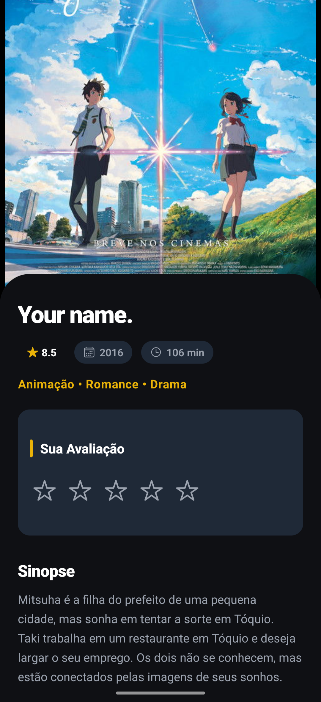
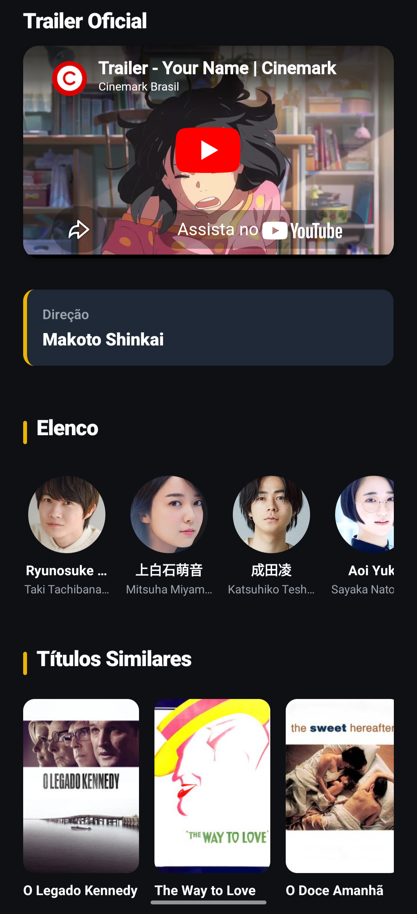
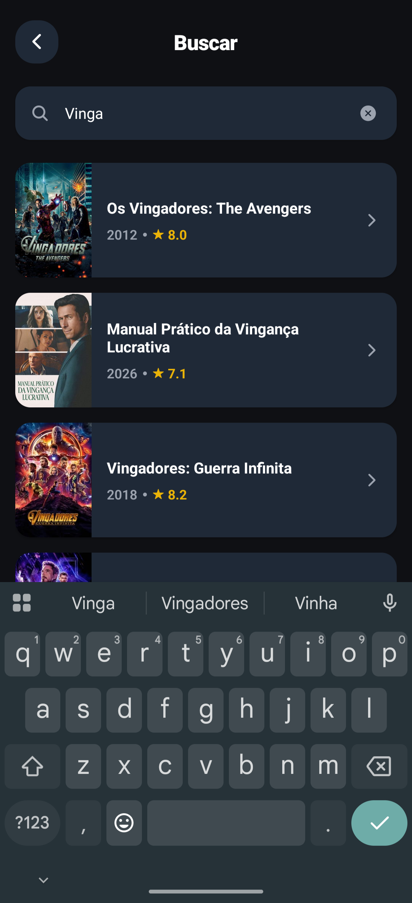
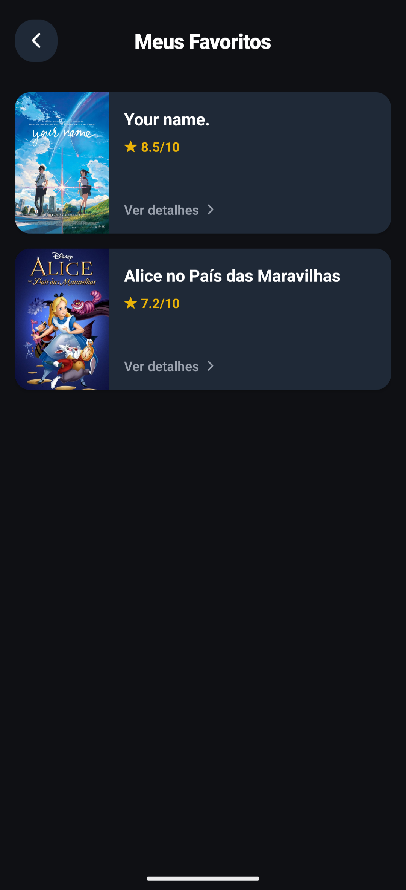
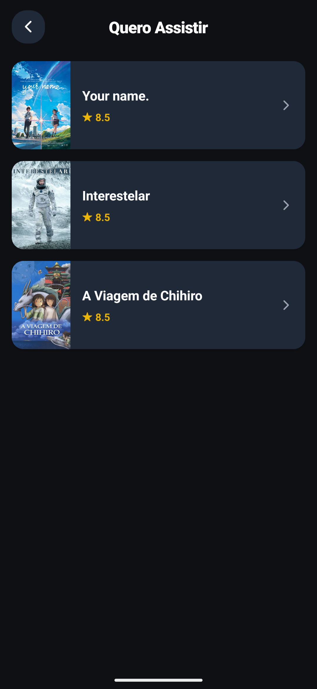
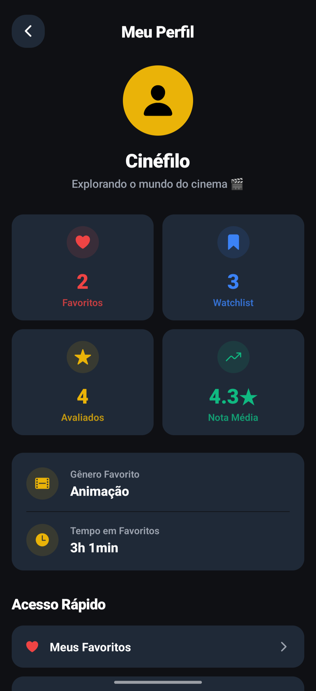
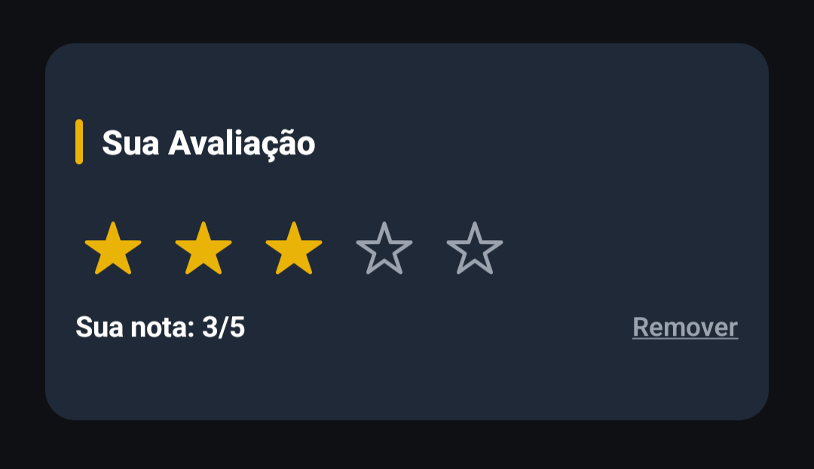
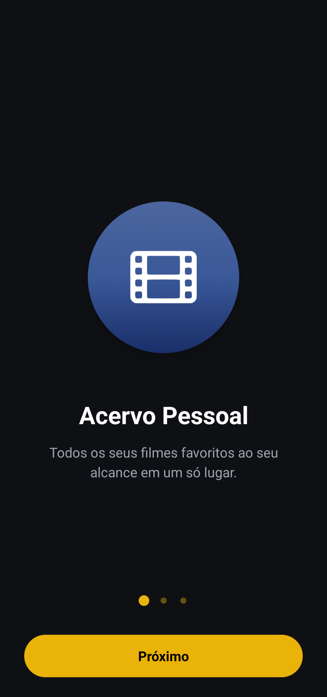

<div align="center">

# 🎬 CineExplorer

**Aplicativo mobile de descoberta de filmes** desenvolvido com React Native, Expo e FastAPI.

Explore filmes populares, filtre por gênero e década, avalie com estrelas, salve seus favoritos e monte sua watchlist pessoal.

### 🎥 Demonstração Completa

https://github.com/user-attachments/assets/971643ac-92b7-4035-92a5-6d61b22437de

> *Ou baixe diretamente: [📥 demo.mp4](./assets/readme/demo.mp4)*

[](https://reactnative.dev/)
[](https://expo.dev/)
[](https://fastapi.tiangolo.com/)
[](https://www.themoviedb.org/)

</div>

---

## 📱 Screenshots

| Home (Dark) | Home (Light) | Detalhes (Topo) | Detalhes (Rodapé) |
|:-----------:|:------------:|:---------------:|:-----------------:|
|  |  |  |  |

| Busca | Favoritos | Watchlist |
|:-----:|:---------:|:---------:|
|  |  |  |

| Perfil | Avaliação | Onboarding |
|:------:|:---------:|:----------:|
|  |  |  |

---

## ✨ Funcionalidades

### 🏠 Home
- Carrossel de filmes **em cartaz** nos cinemas
- Seção de filmes **melhores avaliados**
- Grid de filmes populares com **scroll infinito**
- Filtro por **gênero** (Ação, Comédia, Terror, etc.)
- Filtro por **década** (2020s, 2010s, 2000s, etc.)
- **Pull to Refresh** para atualizar dados
- 🎲 **Roleta** — botão surpresa que sugere um filme aleatório

### 🎬 Detalhes do Filme
- Poster em tela cheia com gradiente
- Nota do TMDB, ano de lançamento e duração
- Lista de gêneros
- ⭐ **Sistema de avaliação pessoal** (1-5 estrelas)
- Sinopse completa
- 🎥 **Trailer oficial** integrado (YouTube)
- Diretor do filme
- Elenco com fotos e personagens
- Filmes similares com navegação

### ❤️ Favoritos
- Salve filmes na lista de favoritos
- Visualize com poster, nota e título
- Acesso rápido aos detalhes

### 📋 Watchlist
- Monte sua lista de filmes para assistir depois
- Interface intuitiva com cards informativos

### 👤 Perfil & Estatísticas
- Total de filmes **favoritados**
- Total na **watchlist**
- Total de filmes **avaliados**
- **Nota média** das avaliações
- **Gênero favorito** (calculado automaticamente)
- **Tempo total** em filmes favoritados
- Atalhos rápidos para navegação

### 🎨 UI/UX
- **Dark Mode / Light Mode** com toggle
- **Skeleton loading** durante carregamento
- **Pull to Refresh** na Home
- Tela de **Onboarding** na primeira abertura
- Design premium com gradientes e animações

---

## 🏗️ Arquitetura

```
discovery-app/
├── backend/                 # API Python
│   ├── main.py              # FastAPI + integração TMDB
│   └── requirements.txt     # Dependências Python
│
├── src/                     # Frontend React Native
│   ├── components/          # Componentes reutilizáveis
│   │   ├── FallbackImage.tsx
│   │   ├── Skeleton.tsx
│   │   └── StarRating.tsx
│   │
│   ├── contexts/            # Contextos globais
│   │   └── ThemeContext.tsx  # Dark/Light mode
│   │
│   ├── screens/             # Telas do app
│   │   ├── Home/
│   │   ├── Details/
│   │   ├── Search/
│   │   ├── Favorites/
│   │   ├── Watchlist/
│   │   ├── Profile/
│   │   └── Onboarding/
│   │
│   ├── services/            # Serviços
│   │   ├── api.ts           # Axios config
│   │   └── storage.ts       # AsyncStorage (CRUD)
│   │
│   ├── routes/              # Navegação
│   │   └── app.routes.tsx
│   │
│   └── types/               # Tipagens TypeScript
│       └── Movie.ts
│
├── App.tsx                  # Entry point
└── package.json
```

---

## 🛠️ Tecnologias

### Frontend
- **React Native** — Framework mobile multiplataforma
- **Expo** — Toolchain de desenvolvimento
- **TypeScript** — Tipagem estática
- **React Navigation** — Navegação entre telas
- **AsyncStorage** — Persistência local (favoritos, watchlist, avaliações)
- **Axios** — Requisições HTTP
- **Expo Linear Gradient** — Gradientes visuais
- **React Native YouTube iFrame** — Player de trailers

### Backend
- **Python** — Linguagem do servidor
- **FastAPI** — Framework web de alta performance
- **Requests** — Chamadas HTTP para a API do TMDB
- **CacheTools (TTLCache)** — Cache em memória com expiração de 5 minutos
- **TMDB API** — Fonte de dados de filmes

---

## ⚡ Otimizações de Performance

| Técnica | Onde | Impacto |
|---------|------|---------|
| **Cache TTL (5min)** | Backend | Reduz chamadas repetidas à API do TMDB |
| **Promise.all** | Tela de Detalhes | Chamadas paralelas (4x mais rápido) |
| **Skeleton Loading** | Home, Detalhes | Feedback visual instantâneo |
| **Passagem de imagem por parâmetro** | Navegação | Poster aparece imediatamente na tela de detalhes |
| **Paginação infinita** | Home | Carrega 20 filmes por vez, sem travamento |

---

## 🚀 Como Rodar

### Pré-requisitos
- Node.js 18+
- Python 3.10+
- Expo Go no celular ([Android](https://play.google.com/store/apps/details?id=host.exp.exponent) / [iOS](https://apps.apple.com/app/expo-go/id982107779))
- Chave da API do TMDB ([criar aqui](https://www.themoviedb.org/settings/api))

### Backend

```bash
cd backend
python -m venv venv
venv\Scripts\activate        # Windows
pip install -r requirements.txt

# Crie o arquivo .env
echo TMDB_API_KEY=sua_chave_aqui > .env

uvicorn main:app --host 0.0.0.0 --reload
```

### Frontend

```bash
# Na raiz do projeto
npm install
npx expo start
```

Escaneie o QR Code com o Expo Go no celular.

---

## 📦 Download

Quer testar sem configurar nada? Baixe o APK direto:

[📥 Baixar APK (Android)](https://expo.dev/artifacts/eas/d9nHKXJFFpyWtMtMNKizPA.apk)

---

## 📄 Licença

Este projeto foi desenvolvido para fins acadêmicos e de portfólio.

---
